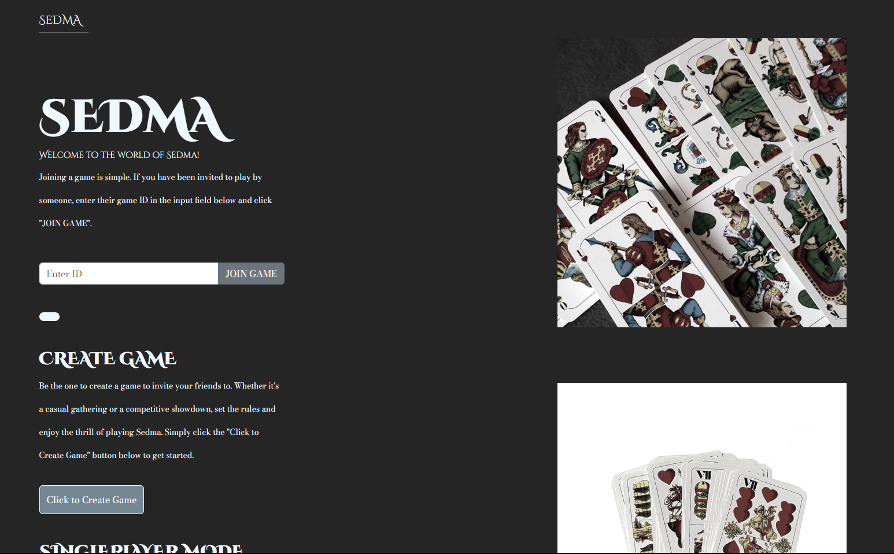
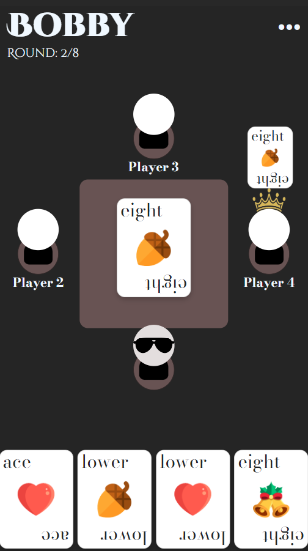

# Online Sedma Card Game

## Introduction

This is an A Level Computer Science NEA project, showcasing an online Czech card game WebApp. It enables users to connect with others and enjoy games of Sedma collaboratively. Additionally, players have the option to engage in single-player mode for solo enjoyment.

## Project Background

In the digital age, where complex virtual reality and 3D games dominate, traditional card games still hold a special place in people's hearts. This project is motivated by the need to bridge the physical gap and enable remote enjoyment of Sedma. The goal was to create a platform that preserves the simplicity and joy of the game.

## Project Structure

This project is structured with distinct client and server components. The client side employs React to manage the user interface, rendering various components for interaction. Meanwhile, the server side, powered by Express.js, governs the game logic and facilitates communication among players, utilizing a REST API and Websockets connection when necessary.

## Sedma Explanation

Sedma is a traditional Czech 4-card trick-and-draw game played in fixed partnerships. The game revolves around capturing tricks and scoring points. The most powerful cards are the Sevens, beating all others. Aces and Tens are scoring cards, each worth 10 points. The objective is to accumulate at least 50 points in a deal. Players strategically play cards to maximize their score, and the game continues until a set number of stakes are reached.

## Gameplay Overview

 
 
- Players take turns playing one card at a time.
- Tricks are won by playing higher-ranked cards or trump cards.
- The team that wins a trick collects the cards and adds up the points.
- The game continues with players drawing new cards and playing tricks until all cards are played.
- The team with at least 50 points wins the deal, converting the win into a set number of stakes.

## Want to give it a try?

1. Go to [sedma.spv99.com](https://sedma.spv99.com/).
2. Enjoy playing Sedma remotely with friends and family!

## License

This project is licensed under the [MIT License](LICENSE).

Copyright (c) 2024 Tamara Sovcikova
